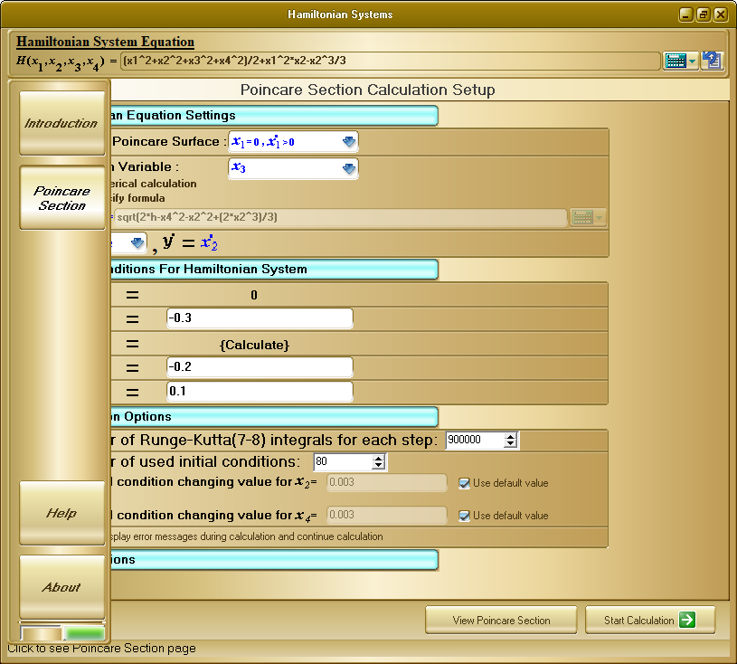
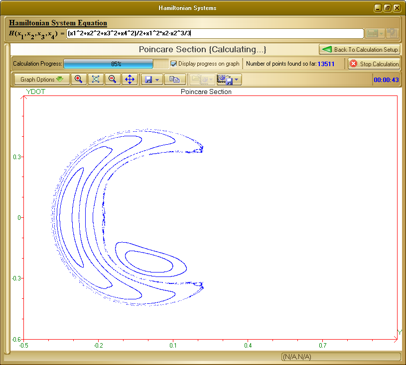
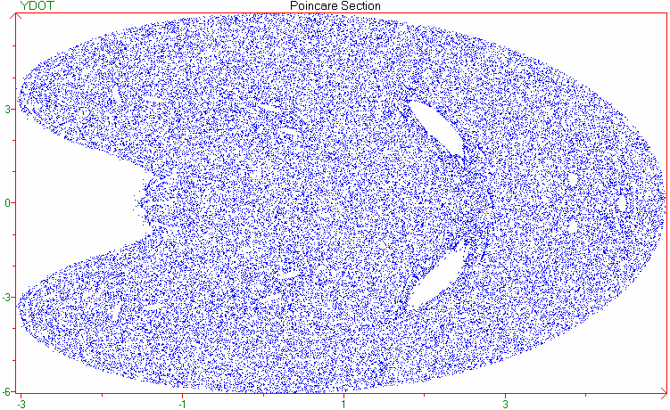

# Poincare Maps of Chaotic Hamiltonian Systems
<b><i><h4>Project originally written in 2006</h4></i></b>

A program, which calculates and plots Poincare Maps of Chaotic Hamiltonian Systems
Written in:
* Fortran : The calculation parts
* Delphi  : The GUI

Calculations based on:
* a thesis by L. Kheibarshekan Asl

Key Features:
* You can define any custom formula
* Export & Import calculated points
* Save graph as image
* Zoom in/out and tools for controlling graph interface

# Sample Images from the Application
* Main Window:

 

* Sample calculated output:

